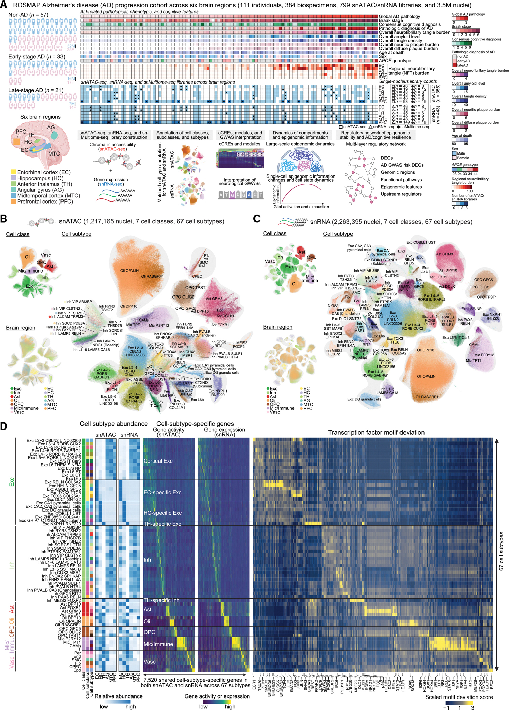
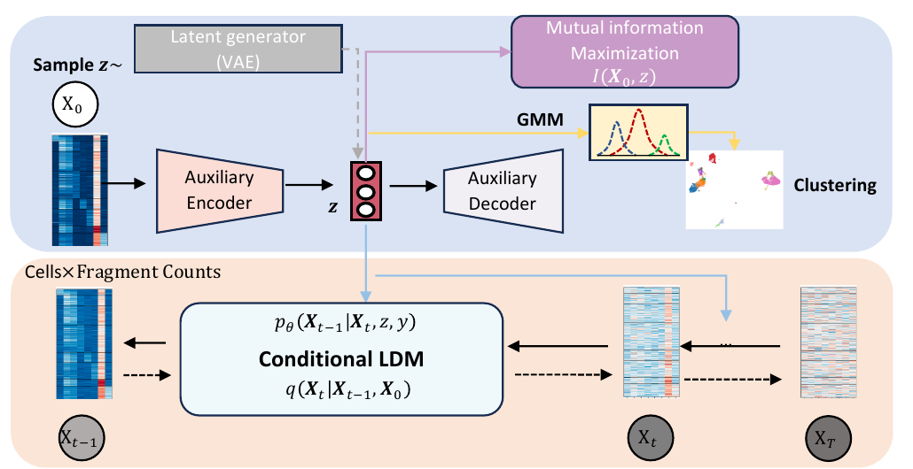
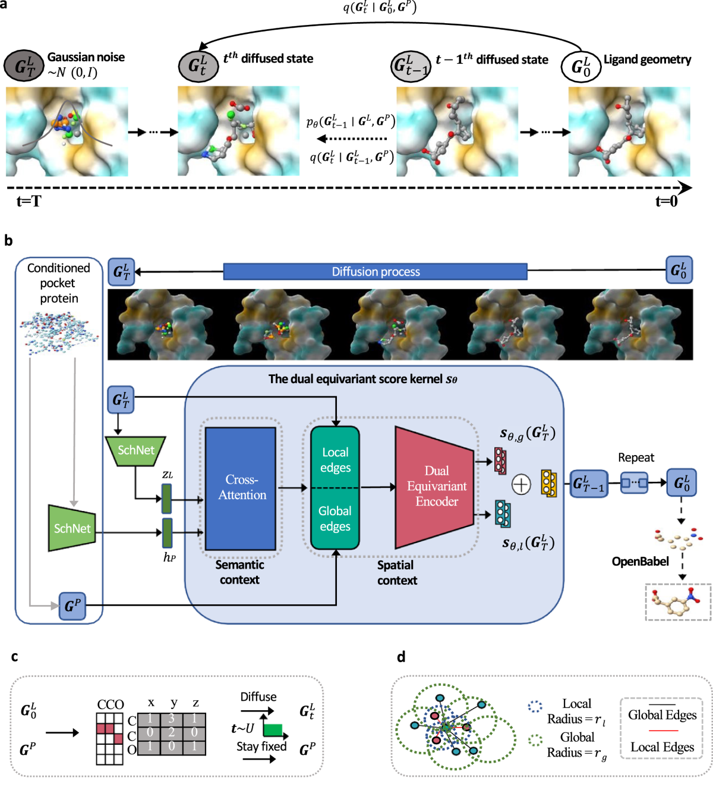

<section class="about-intro" id="home" aria-labelledby="about-heading">
  

    <h2 id="about-heading">About</h2>
    

      I am a Research Fellow at Massachusetts General Hospital and Harvard Medical School, working in Prof.
      <a href="http://ec2-3-220-229-138.compute-1.amazonaws.com/people/" target="_blank" rel="noopener">Luca Pinello's</a>
      group. My work sits at the intersection of artificial intelligence, therapeutic discovery, and computational biology.
    

    

      I received my PhD in Computer Science from City University of Hong Kong, advised by Prof.
      <a href="http://www.cs.toronto.edu/~wkc/" target="_blank" rel="noopener">Ka-Chun Wong</a>. I was previously a visiting scholar with Prof.
      <a href="http://compbio.mit.edu/" target="_blank" rel="noopener">Manolis Kellis</a> at MIT and Prof.
      <a href="https://zitniklab.hms.harvard.edu/" target="_blank" rel="noopener">Marinka Zitnik</a> at Harvard.
    

    

      <a href="./publications.html">Selected publications</a>
      <a href="https://scholar.google.com/citations?user=xO1oupAAAAAJ&hl=zh-CN" target="_blank" rel="noopener">Google Scholar</a>
      <a href="mailto:lhuang34@mgh.harvard.edu">Contact</a>
    

  

</section>

<section class="apple-section" id="research">
  

    <h2>Research</h2>
  

  

    

      My long-term goal is to develop AI systems that make biology more computable, predictable, and actionable. I am particularly interested in generative and foundation models for molecular design and cellular systems, as well as emerging agentic approaches for scientific discovery.
    

    <ul class="research-areas" aria-label="Research areas">
      <li><strong>Generative therapeutics.</strong> Molecular and target-aware design for therapeutic discovery.</li>
      <li><strong>Computational cell models.</strong> Modeling cellular state, regulation, and perturbation from single-cell and multi-omic data.</li>
      <li><strong>Agentic AI for science.</strong> Exploring systems that connect biological hypotheses, data, and design decisions.</li>
    </ul>
  

</section>

<section class="apple-section" id="news">
  

    <h2>News</h2>
  

  

    <article>
      <time>Jul 2025</time>
      

        <h3>Our Alzheimer's single-cell epigenomics paper is published in <em>Cell</em>.</h3>
        
Single-cell multiregion epigenomic rewiring in Alzheimer's disease progression and cognitive resilience. <a href="https://pubmed.ncbi.nlm.nih.gov/40752494/" target="_blank" rel="noopener">Paper</a>

      

    </article>
    <article>
      <time>Oct 2024</time>
      

        <h3>Started as a Research Fellow at MGH / Harvard Medical School.</h3>
        
Joined Prof. Luca Pinello's group to work on generative models for proteins, DNA, and biological element design.

      

    </article>
    <article>
      <time>Sep 2024</time>
      

        <h3>Our single-cell ATAC-seq diffusion model is accepted at NeurIPS 2024.</h3>
        
A versatile informative diffusion model for single-cell ATAC-seq data generation and analysis. <a href="https://proceedings.neurips.cc/paper_files/paper/2024/hash/50d277e84b2bcbaadcd84548a87e8cc4-Abstract-Conference.html" target="_blank" rel="noopener">Paper</a>

      

    </article>
    <article>
      <time>Mar 2024</time>
      

        <h3>Our 3D molecule generation model is published in <em>Nature Communications</em>.</h3>
        
A dual diffusion model enables 3D binding bioactive molecule generation and lead optimization given target pockets. <a href="https://www.nature.com/articles/s41467-024-46569-1" target="_blank" rel="noopener">Paper</a> · <a href="https://github.com/Layne-Huang/PMDM/tree/main" target="_blank" rel="noopener">Code</a>

      

    </article>
  

</section>

<section class="apple-section" id="recent-work">
  

    <h2>Selected work</h2>
  

  

    <article class="feature-row">
      

        Cell
        2025
      

      

        <h3>Single-cell multiregion epigenomic rewiring in Alzheimer's disease progression and cognitive resilience</h3>
        
Collaborative work on disease progression, cognitive resilience, and single-cell epigenomic regulation.

        <figure class="publication-visual publication-visual--cell">
          
          <figcaption>Figure 1 from Liu et al., <em>Cell</em> (2025), CC BY-NC-ND 4.0.</figcaption>
        </figure>
        

          <a href="https://pubmed.ncbi.nlm.nih.gov/40752494/" target="_blank" rel="noopener">Paper</a>
        

      

    </article>

    <article class="feature-row">
      

        NeurIPS
        2024
      

      

        <h3>A versatile informative diffusion model for single-cell ATAC-seq data generation and analysis</h3>
        
A generative framework for chromatin accessibility data, developed during my visiting scholar work with the Kellis Lab.

        <figure class="publication-visual publication-visual--wide">
          
          <figcaption>Figure 1 from Huang et al., NeurIPS (2024).</figcaption>
        </figure>
        

          <a href="https://proceedings.neurips.cc/paper_files/paper/2024/hash/50d277e84b2bcbaadcd84548a87e8cc4-Abstract-Conference.html" target="_blank" rel="noopener">Paper</a>
        

      

    </article>

    <article class="feature-row">
      

        Nature Communications
        2024
      

      

        <h3>A dual diffusion model enables 3D binding bioactive molecule generation and lead optimization</h3>
        
Target-pocket-conditioned molecular generation for structure-aware lead optimization.

        <figure class="publication-visual publication-visual--pmdm">
          
          <figcaption>Figure 1 from Huang et al., <em>Nature Communications</em> (2024), CC BY 4.0.</figcaption>
        </figure>
        

          <a href="https://www.nature.com/articles/s41467-024-46569-1" target="_blank" rel="noopener">Paper</a>
          <a href="https://github.com/Layne-Huang/PMDM/tree/main" target="_blank" rel="noopener">Code</a>
        

      

    </article>
  

</section>
