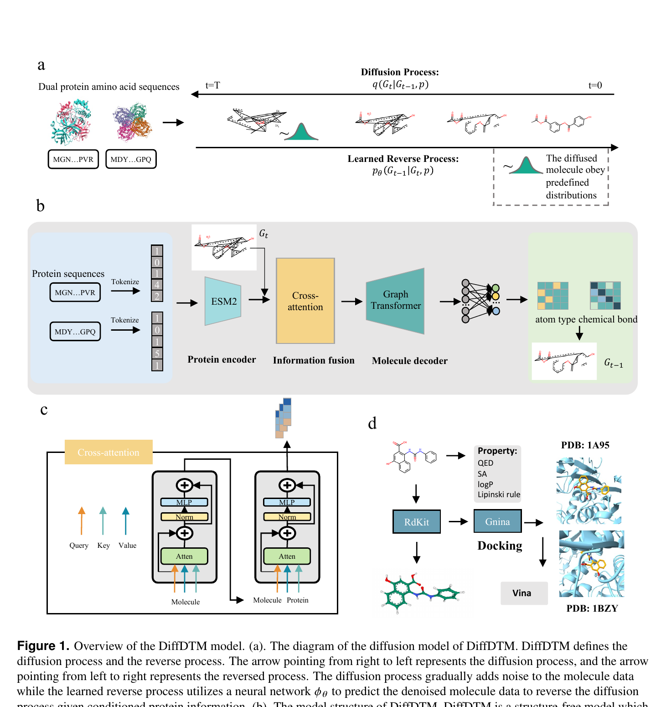
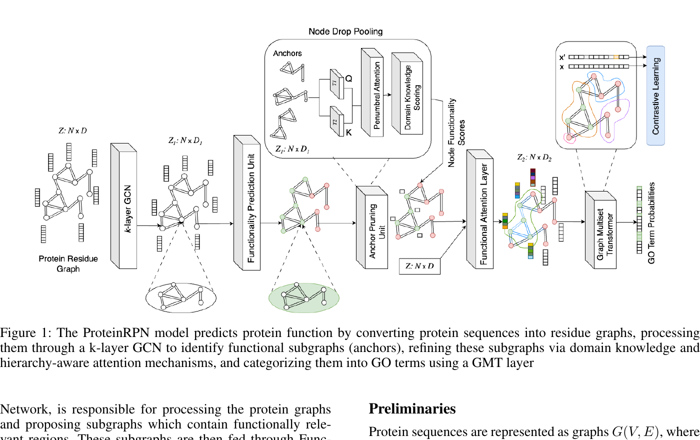
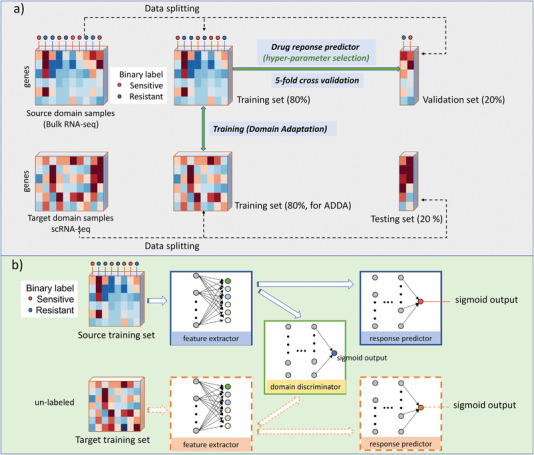
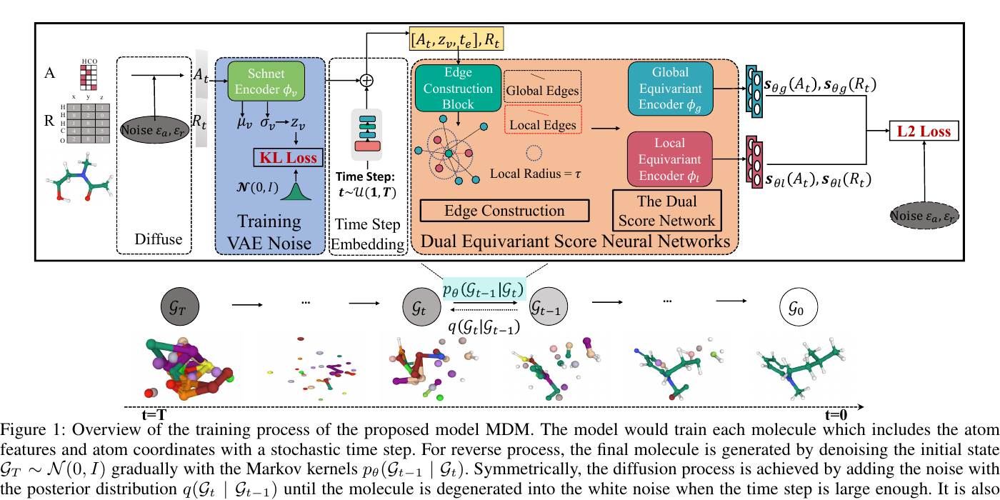
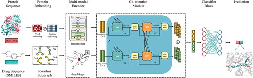
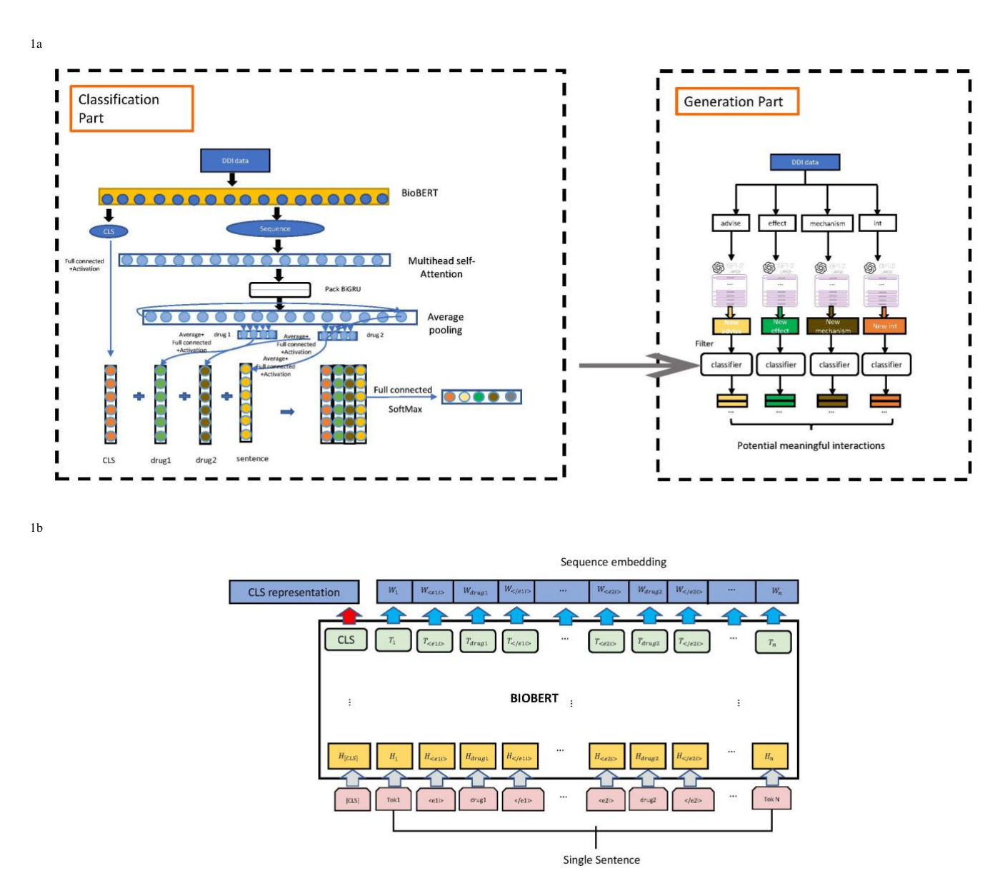

<section class="subpage-hero">
  <h1>Publications</h1>
  

    A focused selection of papers that best represent my work in AI for drug design, biomedical machine learning,
    and computational biology.
  

</section>

<section class="apple-section">
  

    <h2>Selected publications</h2>
  

  

    <article class="publication-item highlight">
      
Cell2025

      <h3>Single-cell multiregion epigenomic rewiring in Alzheimer's disease progression and cognitive resilience</h3>
      
Zunpeng Liu, Shanshan Zhang, ..., <strong>Lei Huang</strong>, ..., Manolis Kellis

      <figure class="publication-visual publication-visual--cell">
        
        <figcaption>Figure 1 from Liu et al., <em>Cell</em> (2025), CC BY-NC-ND 4.0.</figcaption>
      </figure>
      
<a href="https://pubmed.ncbi.nlm.nih.gov/40752494/" target="_blank" rel="noopener">Paper</a>

    </article>

    <article class="publication-item highlight">
      
NeurIPS2024

      <h3>A versatile informative diffusion model for single-cell ATAC-seq data generation and analysis</h3>
      
<strong>Lei Huang</strong>, Lei Xiong, Na Sun, Zunpeng Liu, Ka-Chun Wong, Manolis Kellis

      <figure class="publication-visual publication-visual--wide">
        
        <figcaption>Figure 1 from Huang et al., NeurIPS (2024).</figcaption>
      </figure>
      
<a href="https://proceedings.neurips.cc/paper_files/paper/2024/hash/50d277e84b2bcbaadcd84548a87e8cc4-Abstract-Conference.html" target="_blank" rel="noopener">Paper</a>

    </article>

    <article class="publication-item highlight">
      
Nature Communications2024

      <h3>A dual diffusion model enables 3D binding bioactive molecule generation and lead optimization given target pockets</h3>
      
<strong>Lei Huang</strong>, Tingyang Xu, Yang Yu, Peilin Zhao, Ka-Chun Wong, Hengtong Zhang

      <figure class="publication-visual publication-visual--pmdm">
        
        <figcaption>Figure 1 from Huang et al., <em>Nature Communications</em> (2024), CC BY 4.0.</figcaption>
      </figure>
      
<a href="https://www.nature.com/articles/s41467-024-46569-1" target="_blank" rel="noopener">Paper</a><a href="https://github.com/Layne-Huang/PMDM/tree/main" target="_blank" rel="noopener">Code</a>

    </article>

    <article class="publication-item">
      
IEEE Transactions on Artificial Intelligence2024

      <h3>DiffDTM: A conditional structure-free framework for bioactive molecules generation targeted for dual proteins</h3>
      
<strong>Lei Huang</strong>, Zheng Yuan, Huihui Yan, Rong Sheng, Linjing Liu, Fuzhou Wang, Weidun Xie, Nanjun Chen, Fei Huang, Songfang Huang, Ka-Chun Wong, Yaoyun Zhang

      <figure class="publication-visual publication-visual--diffdtm">
        
        <figcaption>Figure 1 from Huang et al., <em>IEEE Transactions on Artificial Intelligence</em> (2024).</figcaption>
      </figure>
      
<a href="https://arxiv.org/abs/2306.13957" target="_blank" rel="noopener">Paper</a>

    </article>

    <article class="publication-item">
      
Preprint2025

      <h3>ProteinRPN: Towards Accurate Protein Function Prediction with Graph-Based Region Proposals</h3>
      
Shania Mitra, <strong>Lei Huang</strong> (co-first author), Manolis Kellis

      <figure class="publication-visual publication-visual--wide">
        
        <figcaption>Figure 1 from Mitra, Huang, and Kellis, preprint (2025).</figcaption>
      </figure>
      
<a href="https://arxiv.org/abs/2409.00610" target="_blank" rel="noopener">Paper</a>

    </article>

    <article class="publication-item">
      
Advanced Science2023

      <h3>Enabling Single-Cell Drug Response Annotations from Bulk RNA-Seq Using SCAD</h3>
      
Zetian Zheng, Junyi Chen, Xingjian Chen, <strong>Lei Huang</strong>, Weidun Xie, Qiuzhen Lin, Xiangtao Li, Ka-Chun Wong

      <figure class="publication-visual publication-visual--wide">
        
        <figcaption>Figure 1 from Zheng et al., <em>Advanced Science</em> (2023), CC BY.</figcaption>
      </figure>
      
<a href="https://pubmed.ncbi.nlm.nih.gov/36762572/" target="_blank" rel="noopener">Paper</a>

    </article>

    <article class="publication-item">
      
AAAI2023

      <h3>MDM: Molecular Diffusion Model for 3D Molecule Generation</h3>
      
<strong>Lei Huang</strong>, Hengtong Zhang, Tingyang Xu, Ka-Chun Wong

      <figure class="publication-visual publication-visual--wide">
        
        <figcaption>Figure 1 from Huang et al., AAAI (2023).</figcaption>
      </figure>
      
<a href="https://arxiv.org/abs/2209.05710" target="_blank" rel="noopener">Paper</a><a href="https://github.com/tencent-ailab/MDM" target="_blank" rel="noopener">Code</a>

    </article>

    <article class="publication-item">
      
Briefings in Bioinformatics2022

      <h3>CoaDTI: Multi-modal co-attention based framework for drug-target interaction annotation</h3>
      
<strong>Lei Huang</strong>, Jiecong Lin, Rui Liu, Zetian Zheng, Lingkuan Meng, Xingjian Chen, Xiangtao Li, Ka-Chun Wong

      <figure class="publication-visual publication-visual--wide">
        
        <figcaption>Figure 1 from Huang et al., <em>Briefings in Bioinformatics</em> (2022).</figcaption>
      </figure>
      
<a href="https://pubmed.ncbi.nlm.nih.gov/36274236/" target="_blank" rel="noopener">Paper</a>

    </article>

    <article class="publication-item">
      
Briefings in Bioinformatics2021

      <h3>EGFI: Drug-Drug Interaction Extraction and Generation with Fusion of Enriched Entity and Sentence Information</h3>
      
<strong>Lei Huang</strong>, Jiecong Lin, Xiangtao Li, Linqi Song, Zetian Zheng, Ka-Chun Wong

      <figure class="publication-visual publication-visual--egfi">
        
        <figcaption>Figure 1 from Huang et al., <em>Briefings in Bioinformatics</em> (2021).</figcaption>
      </figure>
      
<a href="https://pubmed.ncbi.nlm.nih.gov/34791012/" target="_blank" rel="noopener">Paper</a>

    </article>
  

</section>
